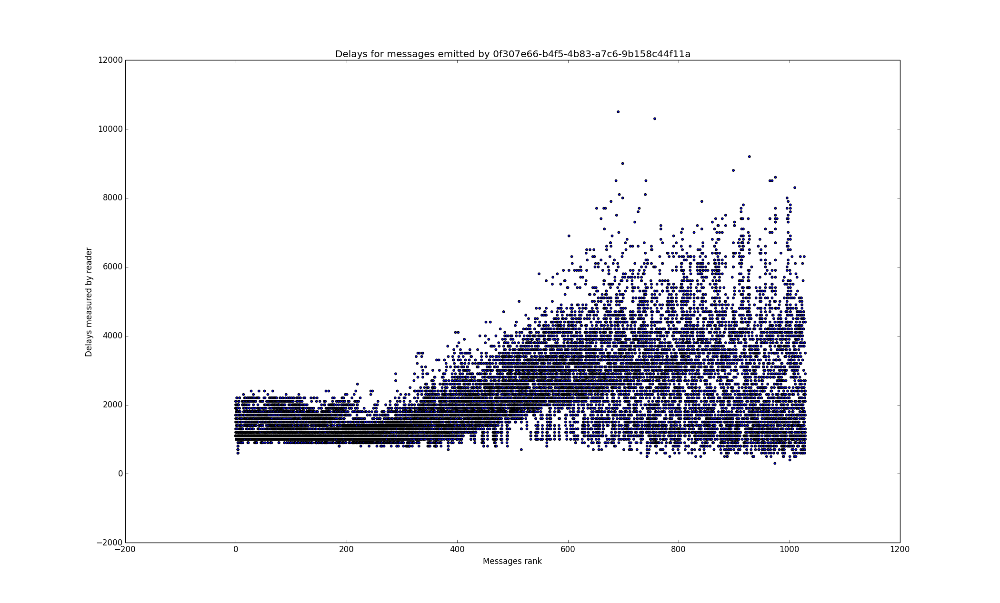
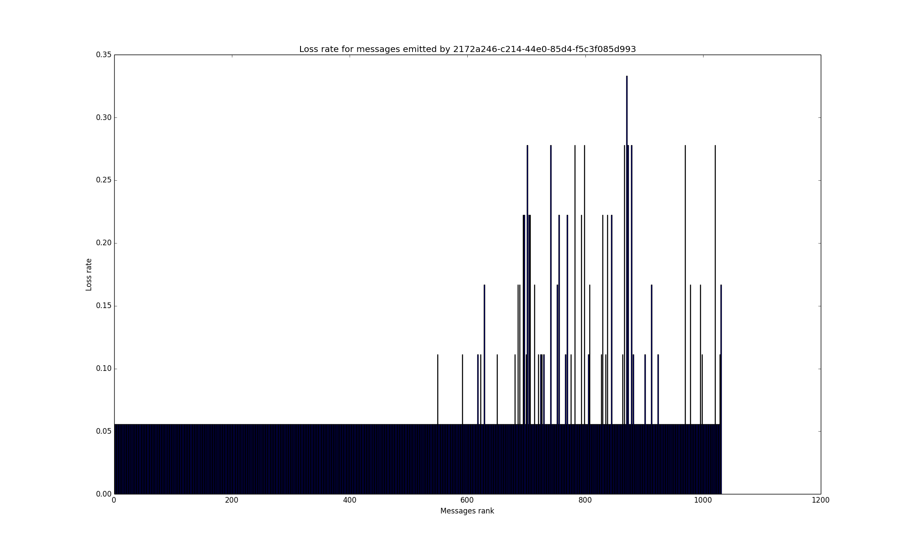

# network_testing
> This application tests the effects of network topologies on user experience and clients resources in the context of p2p collaborative editing 

# Introduction
The project is organized and developed in order to be deployed over grid5000 (for further information : https://www.grid5000.fr/mediawiki/index.php/Grid5000:Home)
Some choices have been made to render the experimentation scripts compliant with Grid5000's tools.

However, you can build your own image and deploy it on other computers grid (a tutorial will explain in details the deployment process and will be the purpose of a future work)
If you want to see the progress of the project, you can consult the TODO file.
Don't hesitate to bring your contributions, I'll be happy to integrate them into the project

# How to use deployment script

## Settings

### Infrastructure
In order to modify parameters related to the infrastructure (system and network) you can to change the following values

You can change :
* The path toward rabbit-mq image
* The path toward server image
* The port on which server is listening
* The path toward client image
* The gateway (if you don't work on Nancy site, you must change it !)
* All the informations related to the targeted application (MUTEHOST DOCID)


```ruby
FSRABBITMQ = 'file:///home/qlaportechabasse/rabbimq-lxc.tar.gz'
FSSERVER = 'file:///home/qlaportechabasse/server-lxc.tar.gz'
FSCLIENT = 'file:///home/qlaportechabasse/client-lxc.tar.gz'
GATEWAY  = '10.147.255.254' # Default gateway of Nancy's sites
DOCID = (0...10).map { ('a'..'z').to_a[rand(26)] }.join
MUTEHOST = 'http://mute-collabedition.rhcloud.com/peer/doc/'
SERVER_PORT = 5000
```

### Experience
If you want to modify parameters related to the experimentation, you can change the following values

You can change :
* The duration of the experimentation
* The number of writers and readers
* The typing speed of writers

```ruby
# Experimentation's settings
writers = 1
readers = 1
typing_speed = 5 # unit word/sec
duration = 240 # time unit : seconde
```

## How to launch the experimentation on grid5k

### Step 1 : Physical nodes reservation
Before this step, you must be connected on a site (for example Nancy)
In order to reserve physical nodes on g5K we use oarsub tool :
```
site> oarsub -t deploy -I -l slash_22=1+{"cluster='CLUSTER'"}/nodes=NODES_NBR,walltime=RESERVATION_DURATION
```

### Step 2 : OS deployment
You must install an operating system before to work on nodes
```
site> kadeploy3 -f $OAR_NODE_FILE -e jessie-x64-nfs -k
```

### Step 3 : IP range reservation
You must keep the IP range given by the command. It will be useful for a next step
```
site> g5k-subnets -sp
```

### Step 4 : Distem tool deployment
We use Distem for virtual node deployment, so we need to install Distem on all physical nodes.
The following command will do the job and give you the coordinator name(the physical node which lead the deployment of virtual nodes)
```
site> distem-bootstrap
```

### Step 5 : Connection to the coordinator
You will control the deployment from the coordinator, so you need to be connected on this node.
```
site> ssh root@coordinator-name
```

### Step 6 : Launch the script
You have to use the deployment.rb script and give the IP range as argument
```
ruby deployment.rb ip-range
```

### Step 7 : Retrieve results
All results are saved in the tmp folder (by default)
You should use scp for retrieving them

Two kinds of results:

* content (ending by 'content.txt') : keeps the text resulting from the collaboration : it could be useful if you want to check the convergence of algorithms involved
* results (ending by 'results.txt') : keeps the traces of messages sent and received by the peer

## Computes results
Exploitation scripts allow you to extract delays and loss rates for each writer in collaboration.

First, you have to save the results.txt files into a specific folder and run it :

```
python computation.py /path/to/specific/folder/ /path/to/output/folder/
```

This script will give you two kinds of CSV files :
* results_delays.csv : this kind of file stores all delays measured for each writer (one file for each writer)
* results_loss-rate.csv : in the same veine, this kind of file stores all loss rates measured for each writer (one file for each writer)

You can plot delays and loss rates for each writer by using display_measurements.py script.

(Both kinds of csv files can be stored in the same folder)

```
python display_measurements.py /folder/containing/csv/files/
```

### Some examples of plotted graphs

Delays :



Loss rates :


